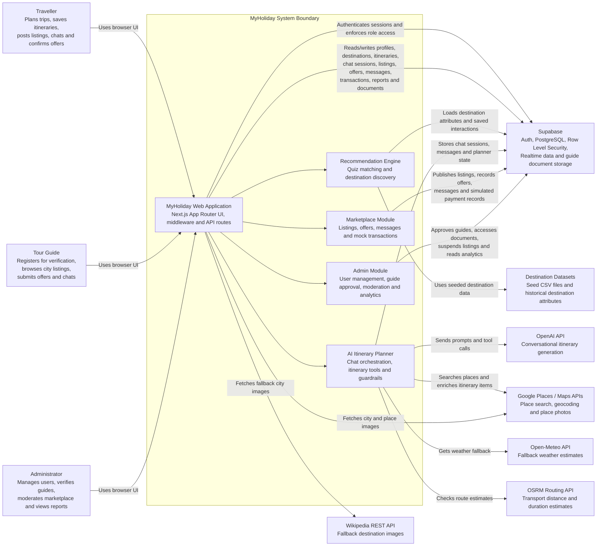

# MyHoliday System Context Diagram

## External Actors

- **Traveller**: registers, completes quiz/profile data, receives destination recommendations, builds AI-assisted itineraries, saves plans, posts marketplace listings, chats with guides, and confirms mock transactions.
- **Tour Guide**: registers through guide onboarding, uploads verification documents, waits for admin approval, views matching city listings, submits offers, chats with travellers, and enables mock payment records.
- **Administrator**: manages traveller accounts, reviews guide applications/documents, moderates marketplace listings, and views dashboard/reporting analytics.

## External Systems

- **Supabase**: provides authentication, PostgreSQL data storage, row-level security, realtime-supported marketplace/chat data, and guide document storage.
- **OpenAI API**: powers the conversational AI itinerary planner through server-side API routes.
- **Google Places / Maps APIs**: support place search, geocoding, nearby places, map coordinates, and place/city imagery.
- **Wikipedia REST API**: provides fallback city imagery when Google imagery is unavailable.
- **Open-Meteo API**: provides fallback weather estimates when destination climate data is unavailable.
- **OSRM Routing API**: provides approximate routing distance and duration for itinerary transport checks.
- **Destination Datasets**: local CSV datasets used to seed and support destination recommendation data.

## Notes

- Payment handling is represented as **mock transactions inside MyHoliday/Supabase**, not a live external payment gateway.
- Role access is enforced in both the Next.js middleware/API layer and Supabase Row Level Security policies.
