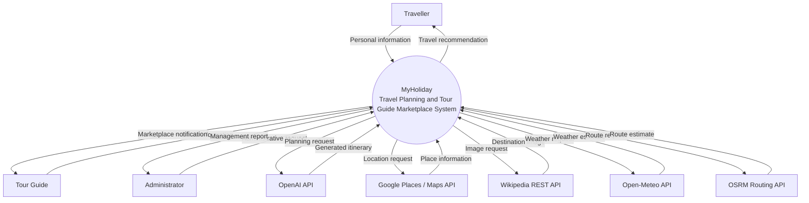

# MyHoliday Context Diagram

## Checklist Alignment

- Uses **one process symbol** for the entire MyHoliday information system.
- Places all people and third-party services as **external entities** around the process.
- Shows only **data flows** between each external entity and the system.
- Does **not** show data stores, databases, internal modules, or implementation components.
