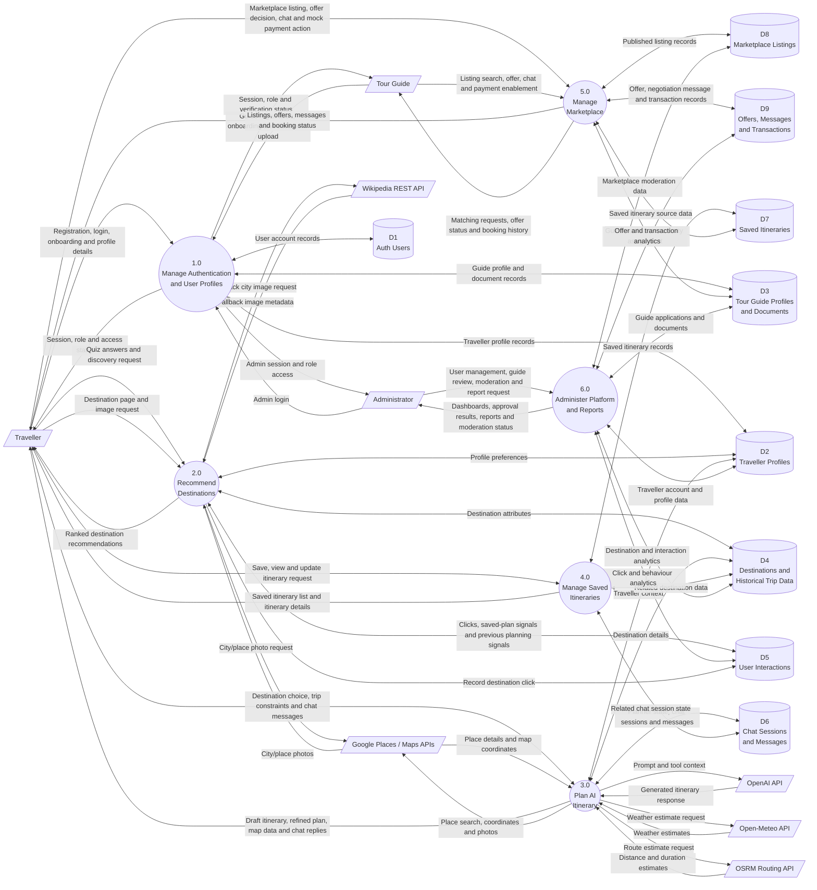

# MyHoliday Data Flow Diagram - Level 0

## External Entities

- **Traveller**: uses MyHoliday to register, complete onboarding, answer the quiz, browse destinations, plan trips with AI, save itineraries, create marketplace listings, chat with guides, and complete mock transactions.
- **Tour Guide**: registers, submits guide verification details, browses traveller marketplace requests, submits offers, chats with travellers, and manages accepted bookings.
- **Administrator**: manages users, reviews guide applications, moderates listings, and views operational reports.
- **OpenAI API**: generates AI itinerary responses.
- **Google Places / Maps APIs**: provides place search, geocoding, coordinates, nearby places, and imagery.
- **Open-Meteo API**: provides fallback weather estimates.
- **OSRM Routing API**: provides route distance and duration estimates.
- **Wikipedia REST API**: provides fallback destination image data.

## Data Stores

- **D1 Auth Users**: Supabase authentication accounts, sessions, and user metadata roles.
- **D2 Traveller Profiles**: traveller onboarding details, preferences, account status, and profile data.
- **D3 Tour Guide Profiles and Documents**: guide onboarding details, city assignment, verification status, and uploaded document references.
- **D4 Destinations and Historical Trip Data**: destination catalogue, destination attributes, climate data, and seeded historical trip data.
- **D5 User Interactions**: destination clicks and behavioural signals used for personalization and reporting.
- **D6 Chat Sessions and Messages**: AI planner conversations, messages, and structured planner state.
- **D7 Saved Itineraries**: saved itinerary JSON content and trip metadata.
- **D8 Marketplace Listings**: traveller-published itinerary requests and listing statuses.
- **D9 Offers, Messages and Transactions**: guide offers, marketplace chat messages, and mock transaction records.

## Process Summary

- **1.0 Manage Authentication and User Profiles** validates users, manages sessions, stores traveller profiles, stores guide profiles, and enforces role-based access.
- **2.0 Recommend Destinations** processes quiz input and behavioural signals to return destination recommendations and personalized discovery results.
- **3.0 Plan AI Itinerary** manages traveller chat input, calls AI and travel-support APIs, stores planner state, and returns itinerary drafts or refinements.
- **4.0 Manage Saved Itineraries** saves generated plans and retrieves itinerary history or itinerary details.
- **5.0 Manage Marketplace** publishes saved itineraries as listings, handles guide offers, supports negotiation chat, and records mock transactions.
- **6.0 Administer Platform and Reports** supports traveller management, guide approval, marketplace moderation, and reporting analytics.

