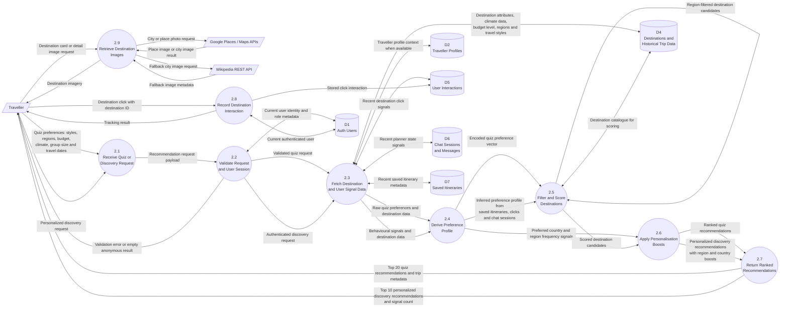

# MyHoliday Data Flow Diagram - Level 1: Recommend Destinations

This Level 1 DFD expands process **2.0 Recommend Destinations** from the Level 0 data flow diagram.

## External Entities

- **Traveller**: submits quiz preferences, opens personalized discovery, views ranked destinations, clicks destination cards, and requests destination imagery.
- **Google Places / Maps APIs**: supplies city and place imagery for destination results.
- **Wikipedia REST API**: supplies fallback city image metadata when Google imagery is unavailable.

## Data Stores

- **D1 Auth Users**: Supabase authentication identity used to personalize discovery and track logged-in clicks.
- **D2 Traveller Profiles**: traveller context available to the wider recommendation experience.
- **D4 Destinations and Historical Trip Data**: destination catalogue, travel style scores, budget level, region, climate data, coordinates, and historical destination attributes.
- **D5 User Interactions**: destination click records used for personalization and analytics.
- **D6 Chat Sessions and Messages**: prior AI planner state used as a behavioural signal for personalized discovery.
- **D7 Saved Itineraries**: saved itinerary metadata used as a strong signal for personalized discovery.

## Process Details

- **2.1 Receive Quiz or Discovery Request** accepts either explicit quiz preferences from the traveller or a personalized discovery request.
- **2.2 Validate Request and User Session** checks required quiz fields and verifies the authenticated user for discovery and click tracking.
- **2.3 Fetch Destination and User Signal Data** loads destinations, saved itineraries, destination clicks, and AI planner session signals from Supabase.
- **2.4 Derive Preference Profile** converts quiz answers into preference vectors or infers preferences from behavioural signals.
- **2.5 Filter and Score Destinations** filters destinations by selected regions, encodes destination features, and calculates cosine similarity scores.
- **2.6 Apply Personalisation Boosts** adds region and country affinity boosts for personalized discovery results.
- **2.7 Return Ranked Recommendations** returns top quiz recommendations with trip metadata or personalized discovery recommendations with signal count.
- **2.8 Record Destination Interaction** stores authenticated destination click events for future personalization.
- **2.9 Retrieve Destination Images** retrieves city/place photos from Google and fallback imagery from Wikipedia.

## Main Data Items

- **Quiz preferences**: travel styles, regions, budget, climate, group size, start date, and end date.
- **Destination features**: culture, adventure, nature, beaches, nightlife, cuisine, wellness, urban, seclusion, budget level, ideal durations, climate, region, and country.
- **Behavioural signals**: saved itinerary metadata, clicked destinations, chat planner state, preferred regions, and preferred countries.
- **Recommendation output**: destination records, match score, trip duration, travel dates, trip metadata, and discovery signal count.

