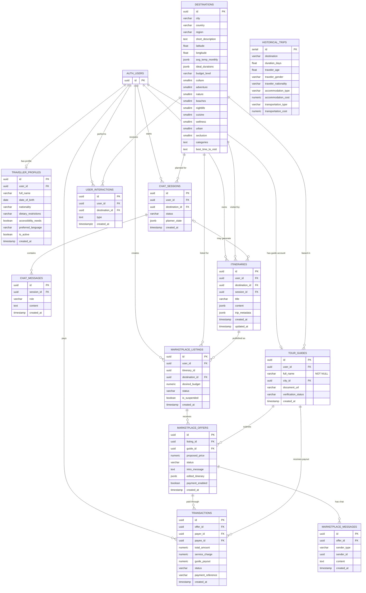

# MyHoliday Entity Relationship Diagram

This ERD is generated from the consolidated Supabase migration in
`supabase/migrations/20260420000000_full_schema.sql`.

## Relationship Notes

- `AUTH_USERS` represents Supabase Auth's `auth.users` table. It is external to the public schema but is referenced by traveller profiles, tour guides, chat sessions, itineraries, listings, transactions, and interactions.
- `traveller_profiles.user_id` and `tour_guides.user_id` are both unique, so each auth user can have at most one traveller profile and at most one tour guide profile.
- `marketplace_messages.sender_id` is polymorphic in application logic. The migration does not define a foreign key for it; `sender_type` determines whether the sender is a traveller user or guide user.
- `marketplace_listings.itinerary_id` stores the source itinerary id, but the current live Supabase public schema does not declare a database foreign key for it.
- `historical_trips` is an ML/survey dataset table and does not declare foreign keys to the operational tables.
- `itineraries.trip_metadata` stores trip context captured during itinerary planning, such as trip dates, duration, pace, group details, and budget preferences.
